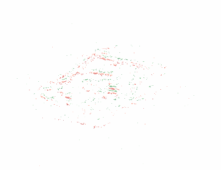
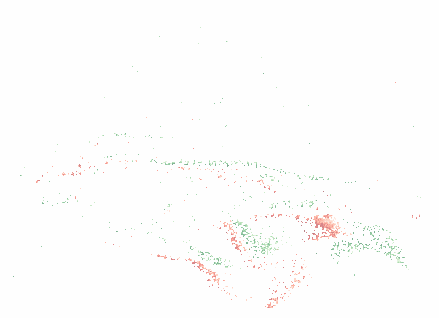
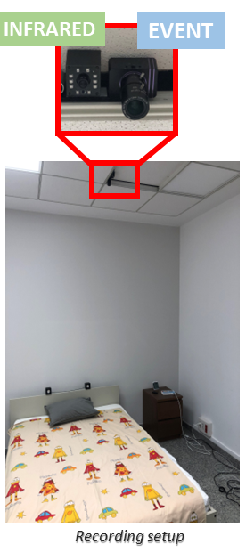
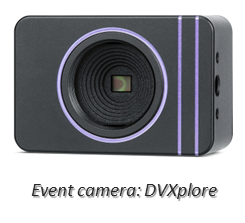
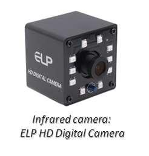
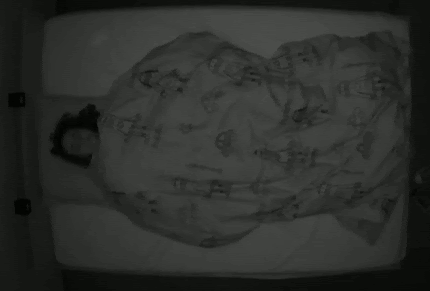
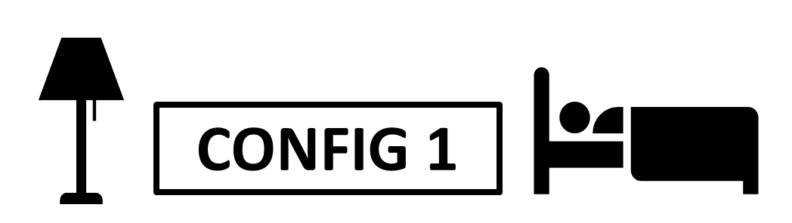
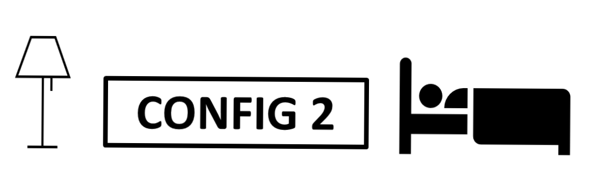
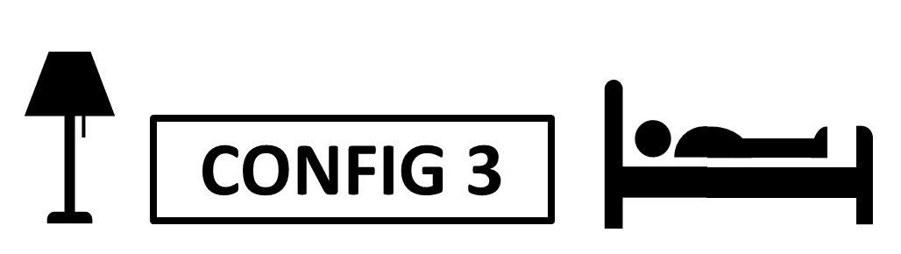
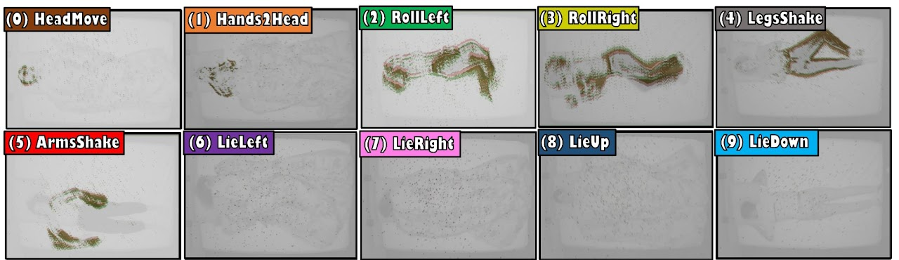

<figure class="teaser">
  <div style="display: flex">
    
    
    
  </div>
</figure>

## Project Context

DeepSleep is a project in collaboration between the RoPeRT research group from Universidad de Zaragoza and BitBrain, a neurotechnology company that combines neuroscience, artificial intelligence, and hardware to help researchers and health professionals leverage neuroscience in a practical and reliable way.

As part of a broader study centered on sleep, this project investigates the suitability of event cameras, to analyze in a non-invasive manner specific behaviors that occur while sleeping and lead to sleeping disorders.

## Introduction

Event cameras are a promising technology for activity recognition in dark environments due to their unique properties. However, real event camera datasets under low-lighting conditions are still scarce, which also limits the number of approaches to solve these kind of problems, hindering the potential of this technology in many applications. We present EventSleep, a new dataset and methodology to address this gap and study the suitability of event cameras for a very relevant medical application: sleep monitoring for sleep disorders analysis.

## Dataset Content

The EventSleep dataset is composed of video sequences of common sleeping movements, recorded with an infrared and an event camera. The use of a realistic recording scenario makes EventSleep the first event-based dataset of activity recognition that includes event sequences recorded under darkness. The EventSleep dataset is already available at Synapse, however infrared data access requires a formal request through email. Further details can be found in the [Wiki Synapse page](https://www.synapse.org/Synapse:syn54156328/wiki/626824#:~:text=To%20request%20Infrared%20data%20access%3A).

The dataset includes video sequences of 14 different participants in 3 different set up configurations that include different ligthing conditions and occlusions, and 10 different fine-grained classes.

### Cameras

Trials were recorded with two different cameras: infrared (ELP HD Digital Camera, 6 fps) and event (DVXplorer camera, 640x480 resolution). Both cameras were placed together attached to a metal bar and located 2 meters above the center of the bed, ensuring a full observation of the participants movements.

 <div style="display: grid; grid-template-columns: repeat(3, 1fr); grid-template-rows: auto auto; gap: 10px; max-width: 500px; margin: 0 auto;">
   
   
   
   
   
 </div>

### Scene Configurations

EventSleep was recorded in a room that mimics a regular room with a double-size bed. Each participant was recorded under 3 settings with varying conditions:

* Config 1: The subject is covered by an eiderdown under full darkness.
* Config 2: The subject is covered by an eiderdown under partial darkness.
* Config 3: The subject is uncovered under full darkness.

The full darkness setup (≤0.1 lux) consists of a bedroom with all lights off, door and window closed, with dense blinds covering the window. The partial darkness setup (0.2 lux) consists of a small night lamp on, placed on the floor far away from the head of the subject.

 <div style="display: grid; grid-template-columns: repeat(3, 1fr); grid-template-rows: auto auto; gap: 10px; max-width: 700px; margin: 0 auto;">
   
   
   
   
   
   
 </div>

### Activity Labels

All subjects were instructed to execute a certain set of movements and positions during each trial. These movements were carefully selected based on their potential relevance to medical research as part of a larger biomedical study project.

Within this context, experts in the field identified specific actions that appear in normal sleep (e.g. transitions between sleep positions) and in sleep disorders such as restless legs syndrome or periodic limb movement (e.g. shaking the legs). Since many sleep studies require the recording of physiological information, we also considered positions that could impact the performance of other sensors such as a headband for polysomnography. The set of 10 activity labels considered are the following:

<div style="text-align: center; margin: 0 auto">
  
</div>

<!-- ## Demos

### ResNet-IR vs ResNet-E

<video muted width="100%" controls>
  <source src="video/ResNetIR-ResNetE.mp4" type="video/mp4">
</video>

### ResNet-BE

<video muted loop width="100%" controls>
  <source src="video/s9_c1_bayesian_slow.mp4" type="video/mp4">
</video> -->

## BibTeX

```
@article{plou2024eventsleep,
  title={EventSleep: Sleep Activity Recognition with Event Cameras},
  author={Plou, Carlos and Gallego, Nerea and Sabater, Alberto and Montijano, Eduardo and Urcola, Pablo and Montesano, Luis and Martinez-Cantin, Ruben and Murillo, Ana C.},
  journal={arXiv preprint arXiv:2404.01801},
  year={2024}
}
```
