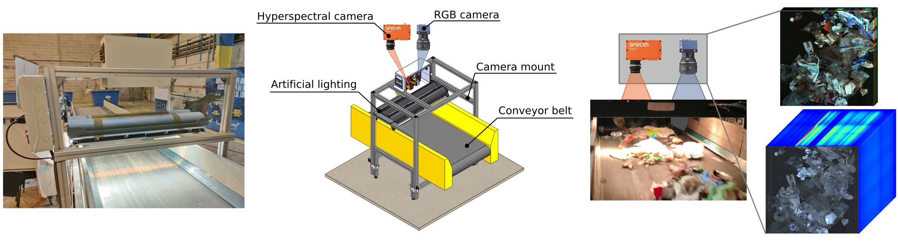

<figure>
  
</figure>

## Description

In this project, we use data from a real waste processing facility specializing in plastics, cartons, and cans. The data was collected with a true-to-life prototype of the conveyor belt installed on the waste separation line, closely mimicking the actual installation. This ensures that the waste streams captured accurately mirror those arriving at the facility for separation. Two synchronized cameras were installed for image gathering: a line-scan RGB camera (Teledyne DALSA Linea) and line-scan hyperspectral camera that captures 224 contiguous spectral bands in a range from 900 to 1700 nm (Specim FX17).

In the collected images, the objects for automatic identification were selected based on the requirements of the facility. Each class represents elements that commonly cause operational problems in recycling lines, impacting the efficiency of the sorting process. Among these problems, machinery jams pose a significant issue, causing a complete stoppage of the process until the obstructing object is removed. These objects include film and basket, large objects that can clog the conveyor belts as they are not easily breakable; video tape and filament, representing long objects prone to entangling with mechanical parts and requiring manual intervention; trash bag, which encompasses closed bags containing waste that need to be mechanically opened for further processing; and cardboard, paper objects whose recovery adds value by sending them to another recycling process.

## Code and Datasets

The raw SpectralWaste dataset is available in the following links. We provide a version only containing the labeled images for easier download. The code to load and process this dataset is available on [GitHub][dataset-repo].

* Raw labeled dataset:
  * RGB and HSI images (105 GB): [OneDrive][raw-labeled-onedrive].
* Raw complete (labeled and unlabeled) dataset:
  * RGB images (3.8 GB): [OneDrive][raw-full-rgb-onedrive].
  * RGB and HSI images (1.3 TB): Please contact the [authors](mailto:fpena@unizar.es,acm@unizar.es).

In the paper we use a preprocessed version of the labeled images for reduced storage, which can be directly downloaded from the following links. The code to replicate the paper experiments using this data is available on [GitHub][segmentation-repo]. 

* Labeled RGB and HSI images (23 GB): [Zenodo][preprocessed-labeled-zenodo], [OneDrive][preprocessed-labeled-onedrive].
* Unlabeled RGB and HSI images (178 GB): [OneDrive][preprocessed-unlabeled-onedrive].

[dataset-repo]: https://github.com/ferpb/spectralwaste-dataset
[segmentation-repo]: https://github.com/ferpb/spectralwaste-segmentation

[preprocessed-labeled-zenodo]: https://zenodo.org/records/10880544
[preprocessed-labeled-onedrive]: https://unizares-my.sharepoint.com/:u:/g/personal/756012_unizar_es/EVJygVCmvs1BrCvA_WEtcIcBkUGbgsmN4fLaWGwr_lLJBw?e=lSPWxs
[preprocessed-unlabeled-onedrive]: https://unizares-my.sharepoint.com/:u:/g/personal/756012_unizar_es/Ea5ec2LtwoVOjlKfobsqbwsBTsgQMbIcnh_p0YbQvEH36A?e=vu4BHh
[raw-labeled-onedrive]: https://unizares-my.sharepoint.com/:f:/g/personal/756012_unizar_es/EkzyB3aciG1GncKAHUdh_sEB2Ch8kGwxLTyvLBHdKTiM_Q?e=feRBh6
[raw-full-rgb-onedrive]: https://unizares-my.sharepoint.com/:u:/g/personal/756012_unizar_es/EWFDxj3rv1JFnPFVLCd0ePwBV3hsps2nwX84nq3orIgHzw?e=wtXoXC

## BibTeX

```
@inproceedings{pena2024spectralwaste,
  title = {{SpectralWaste} Dataset: Multimodal Data for Waste Sorting Automation},
  author = {Casao, Sara and Pe{\~n}a, Fernando and Sabater, Alberto and Castill{\'o}n, Rosa and Su{\'a}rez, Dar{\'i}o and Montijano, Eduardo and Murillo, Ana C.},
  year = {2024},
  booktitle = {2024 IEEE/RSJ International Conference on Intelligent Robots and Systems (IROS)},
  pages = {5852-5858},
  doi = {10.1109/IROS58592.2024.10801797}
}
```

## Acknowledgements

This work was supported by DGA project T45 23R and by MCIN/AEI/ERDF/European Union NextGenerationEU/PRTR project PID2021-125514NB-I00. The authors thank the SEPARA project and all its partners: Ecoembes, Picvisa, PiperLab, Trienekens, Fundación GAIKER and Leitat.


